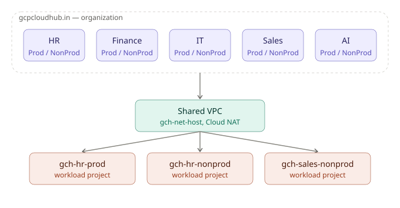

<div align="center">

# 🏗️ gcpcloudhub-fast-foundation

### GCP Organization Landing Zone · Terraform · FAST-Inspired Design · Full Security & Cost Governance

[](https://dashboard.infracost.io/org/gcpcloudhub)
[](https://console.cloud.google.com/billing)
[](https://www.checkov.io)


[](https://www.terraform.io)
[](https://cloud.google.com)
[](https://github.com/features/actions)
[](https://runterrascan.io)
[](https://cloud.google.com/iam/docs/workload-identity-federation)

---

*A hand-built GCP Organization landing zone, inspired by Google Cloud's Fabric FAST framework, written from scratch in Terraform. Nine sequential stages take an empty GCP organization to a fully governed, multi-department platform — org-wide policy guardrails, department-segmented folder hierarchy, shared networking, a quota-aware project factory, centralized security and audit logging, live billed workloads, dual-direction cost visibility, and a VPC Service Controls perimeter — all deployed through a gated CI/CD pipeline authenticated with zero credential files.*

</div>

---

## 📋 Table of Contents

- [Overview](#-overview)
- [Architecture](#-architecture)
- [The Nine Stages](#-the-nine-stages)
- [Security & Compliance](#-security--compliance)
- [Cost Visibility — Both Directions](#-cost-visibility--both-directions)
- [CI/CD Pipeline](#-cicd-pipeline)
- [Tech Stack](#-tech-stack)
- [Well-Architected Framework Alignment](#-well-architected-framework-alignment)
- [Live, Real Infrastructure — Not Just Code](#-live-real-infrastructure--not-just-code)
- [Testing](#-testing)
- [Design Decisions](#-design-decisions)
- [Known Limitations](#-known-limitations)
- [Prerequisites & Reproduction](#-prerequisites--reproduction)
- [Teardown](#-teardown)
- [Repository](#-repository)

---

## 🌐 Overview

This project answers one question end to end: **how would you actually bootstrap a real GCP organization, correctly, from nothing?**

It isn't a tutorial repo or a copy of Google's own FAST reference — it's a working reimplementation of the same ideas, built stage by stage against a real Cloud Identity organization, with every permission gap, quota limit, and misconfiguration discovered and fixed the way it happens in practice, not glossed over.

### 🔑 Key Facts

| Property | Value |
|---|---|
| 🏗️ **IaC Engine** | Terraform 1.15, real `plan` / `apply` / `destroy` against live GCP |
| ☁️ **Cloud Platform** | Google Cloud Platform (Cloud Identity org, 5 department folders, 3 billed projects) |
| 🧩 **Stages** | 9 sequential, independently-stated Terraform root modules (00–08) |
| 🔐 **Auth** | Workload Identity Federation — zero service account keys, anywhere |
| 🛡️ **Security Scanners** | Checkov + Terrascan, both wired into pre-commit and CI |
| 💰 **Cost Tools** | Infracost (predicted, pre-deploy) + native BigQuery billing export (actual, post-deploy) |
| 🧪 **Testing** | Native `terraform test`, daily automated drift detection across all 9 stages |
| 📦 **CI/CD** | GitHub Actions — gated plan/apply chain, Dependabot, CODEOWNERS |
| 📝 **Docs** | Auto-generated per-stage variable/output tables via terraform-docs, 4 formal ADRs |

### ✨ What It Does

| Capability | Description |
|---|---|
| 🏛️ **Org-wide guardrails first** | 6 org policies (no default networks, no VM public IPs, no SA keys, no public buckets/SQL, domain-restricted IAM) applied *before* any folder or project exists |
| 🏢 **Department-segmented hierarchy** | 5 departments × Prod/NonProd, not a flat environment-only structure — models how larger orgs actually split budget and access |
| 🌐 **Real shared networking** | One Shared VPC host project, Prod/NonProd subnets, Cloud NAT, IAP-only SSH, flow logs, Private Google Access |
| 🏭 **Quota-aware project factory** | Explicit `enabled_workloads` list rather than a full department × environment cross-product — built after hitting a real free-tier billing quota wall |
| 🔒 **Centralized security posture** | Org-wide audit log sink, least-privilege custom IAM role (replacing broad `roles/editor`), Secret Manager pattern, Security Command Center |
| 💵 **Real, priced workload** | A live Cloud Run service *and* a hardened e2-micro VM — deliberately added so cost tooling has something non-zero to actually prove |
| 🚧 **VPC Service Controls** | Real perimeter in dry-run mode — logs violations without blocking live workloads, with a documented path to enforcement |
| 🔁 **Fully automated pipeline** | Every stage applies through CI, gated behind manual approval, checked daily for drift |

---

## 🏛️ Architecture



```
                    Organization: gcpcloudhub.in
                                │
        ┌───────────┬───────────┼───────────┬───────────┐
        ▼           ▼           ▼           ▼           ▼
       HR        Finance        IT        Sales         AI
   Prod/NonProd  Prod/NonProd  Prod/NonProd Prod/NonProd Prod/NonProd
                                │
                                ▼
                        Shared VPC (03)
                   gch-net-host · Cloud NAT
                                │
              ┌─────────────────┼─────────────────┐
              ▼                 ▼                 ▼
        gch-hr-prod       gch-hr-nonprod    gch-sales-nonprod
      (04-project-factory, attached as Shared VPC service projects)
              │
              ▼
   06-workload-demo: live Cloud Run + hardened e2-micro VM
```

### 🔄 Stage Dependency Chain

| Order | Stage | Depends On |
|---|---|---|
| 1 | `00-bootstrap` | — (creates the seed project, state bucket, automation identity) |
| 2 | `01-org-policies` | 00 |
| 3 | `02-resman` | 00, 01 |
| 4 | `03-networking` | 00–02 |
| 5 | `04-project-factory` | 00–03 |
| 6 | `05-security` | 00–04 |
| 7 | `06-workload-demo` | 00–05 |
| 8 | `07-cost-visibility` | 00 |
| 9 | `08-vpc-sc` | 03, 04 |

Each stage is its own Terraform root module with isolated state (same GCS bucket, different prefix per stage) — a mistake in one stage's state can't corrupt another's.

---

## 📦 The Nine Stages

| Stage | What It Builds |
|---|---|
| 🌱 **00-bootstrap** | Seed automation project, versioned GCS state bucket with lifecycle rules, automation service account, Workload Identity Federation pool/provider scoped to this exact repo, billing budget alert (50/90/100%) |
| 🛡️ **01-org-policies** | 6 org-wide guardrails: `skipDefaultNetworkCreation`, `vmExternalIpAccess` (deny all), `disableServiceAccountKeyCreation`, `storage.publicAccessPrevention`, `sql.restrictPublicIp`, `iam.allowedPolicyMemberDomains` |
| 🏢 **02-resman** | 5 department folders (HR, Finance, IT, Sales, AI) × Prod/NonProd sub-folders, org and folder IAM bound to Google Groups (never individuals), a least-privilege custom `gchDevopsScoped` role |
| 🌐 **03-networking** | Shared VPC host project, Prod/NonProd subnets, Cloud NAT, firewall rules (internal-only + IAP-scoped SSH), VPC Flow Logs, Private Google Access, Shared VPC host designation |
| 🏭 **04-project-factory** | Real, billed workload projects, explicitly gated by an `enabled_workloads` list (not a full cross-product) to respect free-tier billing-account project-link quotas, Shared VPC attachment, full audit logging, cost-allocation labels |
| 🔐 **05-security** | Org-wide audit log sink into a dedicated logging bucket, Secret Manager pattern (container-only, no values in state), log-based metric + alert policy on IAM policy changes |
| 🚀 **06-workload-demo** | A real Cloud Run service (domain-restricted access via org policy) and a hardened e2-micro VM — Shielded VM, no external IP, no project-wide SSH keys — the only priced resources in the project, deliberately |
| 💰 **07-cost-visibility** | Terraform-managed BigQuery dataset, Google-native billing export (one manual Console step — documented as GCP's own Terraform-resource gap), a starter cost-by-department SQL query |
| 🚧 **08-vpc-sc** | Access Context Manager policy + service perimeter around all workload/networking projects, running in **dry-run mode** — logs violations without blocking, safe alongside already-live workloads |

---

## 🛡️ Security & Compliance

| Tool | Role |
|---|---|
| 🔍 **Checkov** | Static analysis on every commit (pre-commit) and every PR (CI). Currently **78 passed, 5 accepted, documented exceptions** — down from 22 initial findings |
| 🔎 **Terrascan** | Second, independent scanner (OPA/Rego rule engine) — 191 policies evaluated, **0 violations** |
| 🏛️ **Org Policies** | 6 guardrails applied before any resource exists — caught a real misconfiguration live (an attempted `allUsers` grant on Cloud Run was auto-blocked) |
| 🔑 **Least-privilege IAM** | Broad `roles/editor` replaced with a scoped custom role after Checkov flagged it — a real fix, not just an accepted finding |
| 🛰️ **Security Command Center** | Enabled at org level, Standard tier |
| 📜 **Audit logging** | Full Admin Read / Data Read / Data Write logging explicitly enabled on every project, feeding a centralized org-wide sink |
| 🚧 **VPC Service Controls** | Real perimeter, dry-run mode, safe rollout pattern documented |
| 📄 **4 Architecture Decision Records** | Department+env folders, WIF over SA keys, org-policies-before-resman sequencing, module-as-template (not retrofit) |

---

## 💰 Cost Visibility — Both Directions

Most projects show cost estimation *or* actual billing. This one does both, deliberately.

### Predicted (before deployment) — Infracost
- Runs on every human-opened PR via `terraform-plan.yml`, posts a real cost-delta comment
- Full dashboard at `dashboard.infracost.io/org/gcpcloudhub`
- **Live-updating README badge** — pulled from a Gist that CI refreshes after every merge to `main`

### Actual (after deployment) — Google-native billing export
- `07-cost-visibility`: Terraform-managed BigQuery dataset, real detailed-usage-cost export enabled
- A starter SQL query groups real spend by the `department` label applied to every project
- Configuration independently re-verified against the actual BigQuery schema (`project.labels`, not an assumed field name) after an initial query was found to be wrong

### What makes the $ figure real, not theoretical
The live badge shows an actual, non-zero dollar amount — because `06-workload-demo`'s e2-micro VM was deliberately added, priced correctly for `asia-south1` (outside GCP's free-tier region list), specifically so the cost pipeline had something real to prove. It stayed accurate through a live Terraform apply and multiple dependency version bumps.

---

## ⚙️ CI/CD Pipeline

| Workflow | Trigger | Purpose |
|---|---|---|
| `terraform-plan.yml` | Every PR | Plans all 9 stages in parallel, runs native Terraform tests, posts Infracost + Checkov comments |
| `terraform-apply.yml` | Push to `main` | Applies all 9 stages **sequentially**, gated behind a `prod` environment requiring manual approval |
| `drift-detection.yml` | Daily cron + manual dispatch | Read-only `plan -detailed-exitcode` across every stage; auto-files a GitHub issue if live infrastructure has drifted from state |

- **Workload Identity Federation** — every workflow authenticates to GCP via short-lived OIDC tokens scoped to this exact repository. No JSON key file has ever existed.
- **Dependabot** — Terraform provider versions + GitHub Actions versions, both tracked weekly
- **CODEOWNERS** — highest-blast-radius stages (`01-org-policies`, `05-security`) require explicit review
- **Pre-commit hooks** — `terraform fmt`, `terraform validate`, `checkov`, `terraform-docs`

---

## 🧰 Tech Stack

| Category | Tools |
|---|---|
| **IaC** | Terraform 1.15, HCL, native `terraform test` |
| **Cloud** | Google Cloud Platform — Cloud Identity, Resource Manager, Org Policy, IAM, Compute Engine, Cloud Run, Cloud NAT, VPC, Cloud Storage, BigQuery, Secret Manager, Cloud Logging, Cloud Monitoring, Security Command Center, Access Context Manager, Cloud Billing |
| **CI/CD** | GitHub Actions, Workload Identity Federation, Dependabot |
| **Security scanning** | Checkov, Terrascan |
| **Cost tooling** | Infracost, BigQuery (native billing export) |
| **Documentation** | terraform-docs, Architecture Decision Records, Mermaid/SVG architecture diagram |
| **Badges/automation** | shields.io dynamic endpoints, GitHub Gist as a lightweight data store, `schneegans/dynamic-badges-action` |

---

## 🧭 Well-Architected Framework Alignment

| Pillar | How It's Addressed |
|---|---|
| 🔐 **Security, Privacy & Compliance** | Org policies, group-based IAM, WIF, Checkov + Terrascan, VPC-SC dry-run |
| 💰 **Cost Optimization** | Budget alerts, resource labels, quota-aware project factory, dual-direction cost visibility |
| ⚡ **Performance Optimization** | Region chosen for proximity (`asia-south1`), Shared VPC architecture leaves room for regional expansion |
| 🛠️ **Reliability** | Fully code-defined infrastructure, GCP-managed HA networking components, daily drift detection |
| 🚀 **Operational Excellence** | Full IaC, isolated per-stage state, documented design decisions, gated CI/CD, native testing |

Full detail in [`WELL-ARCHITECTED.md`](WELL-ARCHITECTED.md).

---

## 🧪 Live, Real Infrastructure — Not Just Code

Every stage was applied against a **real Cloud Identity organization**, not a simulated environment. Real problems were hit and fixed the way they happen in production, not edited out afterward:

| Real Issue Hit | Root Cause | Fix |
|---|---|---|
| Free-tier billing quota wall | Only 5 projects can be simultaneously linked to a trial billing account | Explicit `enabled_workloads` gating instead of a full cross-product |
| Org policy blocked a live deployment | `iam.allowedPolicyMemberDomains` rejected an `allUsers` grant attempt | Scoped access to `domain:gcpcloudhub.in` instead — the guardrail working as intended |
| Automation SA couldn't run in CI | Prior applies ran under a human user's broader credentials | Explicit Owner + org-level roles granted to the SA, closing a real gap CI exposed |
| Checkov badge showed `?` for 4 iterations | Wrong assumed JSON output structure, wrong file path, YAML parsing breaks on nested heredocs | Diagnosed via real Actions log inspection, fixed against confirmed real output |
| Billing export query referenced a nonexistent table | Assumed generic table name instead of verifying via `INFORMATION_SCHEMA` | Re-verified against the real schema, corrected the query and docs |

---

## 🧪 Testing

- **Native `terraform test`** (Terraform ≥1.6) — validates key assertions for `01-org-policies` (policy configuration correctness) and `02-resman` (folder structure counts), wired into the plan workflow
- **Daily automated drift detection** — all 9 stages, read-only, auto-files a GitHub issue on any mismatch between live state and configuration
- Test coverage is intentionally partial — a fuller suite covering every stage is a documented next step, consciously scoped down in favor of breadth across security, cost, and CI/CD within reasonable project scope

---

## 🧠 Design Decisions

Full reasoning in [`docs/decisions/`](docs/decisions/):

1. **Department + environment folders** over a flat environment-only structure
2. **Workload Identity Federation** over service account keys for all CI/CD auth
3. **Org policies applied before resource management** — guardrails exist before anything they'd guard
4. **Reusable Terraform module built as a template**, deliberately not retrofitted into live, working stages

---

## ⚠️ Known Limitations

- **Billing export activation is a manual Console step** — GCP's Cloud Billing API has no Terraform resource for linking export to a dataset
- **Infracost doesn't run on Dependabot's own PRs** — GitHub blocks repository secrets from Dependabot-triggered workflows by design
- **VPC Service Controls runs in dry-run mode**, not enforced — a deliberate choice given live workloads were already running when the stage was added; documented path to enforcement included

---

## 🚀 Prerequisites & Reproduction

- A GCP Organization (Cloud Identity Free or Google Workspace)
- A billing account linked to that org
- Four Google Groups created in advance (`gcp-organization-admins`, `gcp-billing-admins`, `gcp-security-admins`, `gcp-devops`)
- Terraform ≥ 1.6, `gcloud` CLI with Organization Administrator access
- `.tfvars.example` provided for every stage — copy, fill in your real values, never commit the result

```bash
cd 00-bootstrap && terraform init && terraform apply
cd ../01-org-policies && terraform init && terraform apply
cd ../02-resman && terraform init && terraform apply
cd ../03-networking && terraform init && terraform apply
cd ../04-project-factory && terraform init && terraform apply
cd ../05-security && terraform init && terraform apply
cd ../06-workload-demo && terraform init && terraform apply
cd ../07-cost-visibility && terraform init && terraform apply
cd ../08-vpc-sc && terraform init && terraform apply
```

---

## 🧹 Teardown

Destroy in exact reverse order — see the full [`Teardown`](README.md#teardown) notes in-repo for stage-specific caveats (seed project deletion protection, custom role soft-delete retention, VPC-SC/networking destroy ordering).

---

## 🔗 Repository

| Repository | Purpose |
|---|---|
| [`gcpcloudhub-fast-foundation`](https://github.com/bikram-singh/gcpcloudhub-fast-foundation) | GCP Organization Landing Zone · Terraform · FAST-Inspired · Full Governance |

---

<div align="center">

**Maintained by Bikram Singh**

*Built with Terraform · Google Cloud Platform · GitHub Actions · Checkov · Terrascan · Infracost*

</div>
